# Decisões Técnicas

## Stack escolhida

- **Frontend**: Next.js + Tailwind CSS + TypeScript
- **Backend**: NestJS + API REST
- **Banco de dados**: PostgreSQL
- **Infraestrutura**: Docker + Docker Compose
- **Documentação / GitHub Pages**: Docsify + `.nojekyll`

## Justificativas

- **Next.js** oferece SSR/SSG e boa organização de páginas/componentes.
- **Tailwind CSS** permite desenvolver uma interface responsiva rápida e consistente.
- **NestJS** dá estrutura MVC e organização por módulos para a API.
- **PostgreSQL** atende persistência relacional de turmas, alunos e frequência.
- **Docker** garante ambiente idêntico em todos os estágios.
- **Docsify** atende documentação leve, carregada diretamente no `docs/`.

## Diagrama de Arquitetura (Docker & Serviços)

O diagrama abaixo ilustra a arquitetura do sistema e a comunicação entre os containers definidos no `docker-compose.yml`:

```mermaid
graph LR
    User(["Usuário<br>(Browser / Mobile)"])

    subgraph Docker_Host ["Docker Host (Ambiente Local / Deploy)"]
        
        subgraph Frontend_Container ["Container: engnet_frontend"]
            P3001[["Porta: 3001"]] --- NextJS["Next.js Application<br>(Frontend SSR & Client)"]
        end

        subgraph Backend_Container ["Container: engnet_backend"]
            P3000[["Porta: 3000"]] --- NestJS["NestJS API REST<br>(Lógica de Negócio)"]
        end

        subgraph DB_Container ["Container: engnet_db"]
            P5432[["Porta: 5432"]] --- Postgres[("Banco de Dados<br>PostgreSQL 15")]
        end
        
        Volume_DB_Data[["Volume: db_data<br>(Persistência)"]]
    end

    %% Conexões externas
    User -- "Acessa a interface web" --> P3001
    User -- "API Client-side" --> P3000
    
    %% Conexões internas
    NextJS -- "Requisições Server-side" --> P3000
    NestJS -- "ORM/SQL" --> P5432
    Postgres -. "Persiste dados" .-> Volume_DB_Data

    %% Estilização Avançada
    style User fill:#10b981,stroke:#047857,stroke-width:2px,color:#fff
    style Docker_Host fill:#ffffff,stroke:#333333,stroke-width:2px,stroke-dasharray: 5 5
    style Frontend_Container fill:#eff6ff,stroke:#3b82f6,stroke-width:2px
    style Backend_Container fill:#faf5ff,stroke:#a855f7,stroke-width:2px
    style DB_Container fill:#fff7ed,stroke:#f97316,stroke-width:2px
    style Volume_DB_Data fill:#f3f4f6,stroke:#9ca3af,stroke-width:2px

    %% Estilização das Portas
    classDef porta fill:#f1f5f9,stroke:#475569,stroke-width:2px,color:#1e293b,stroke-dasharray: 3 3;
    class P3001,P3000,P5432 porta;
```

